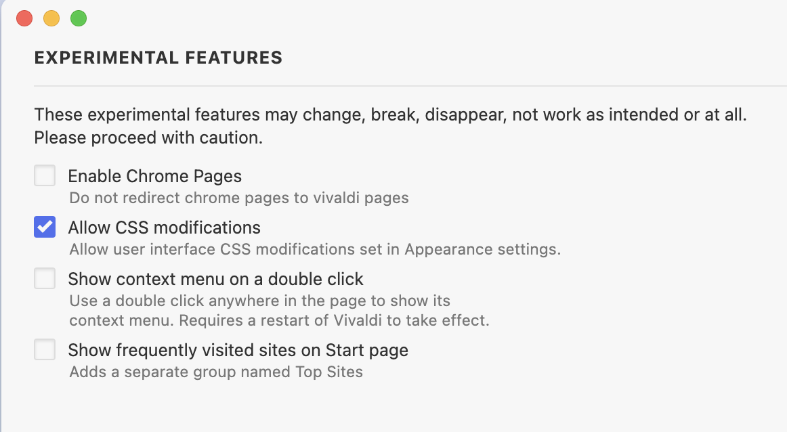
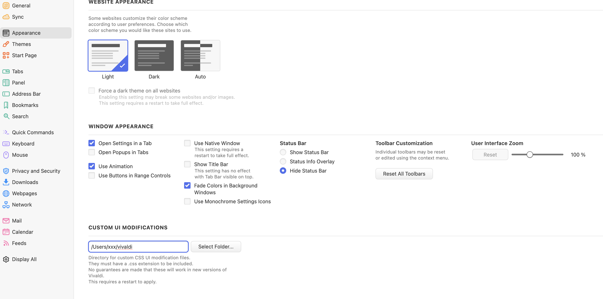
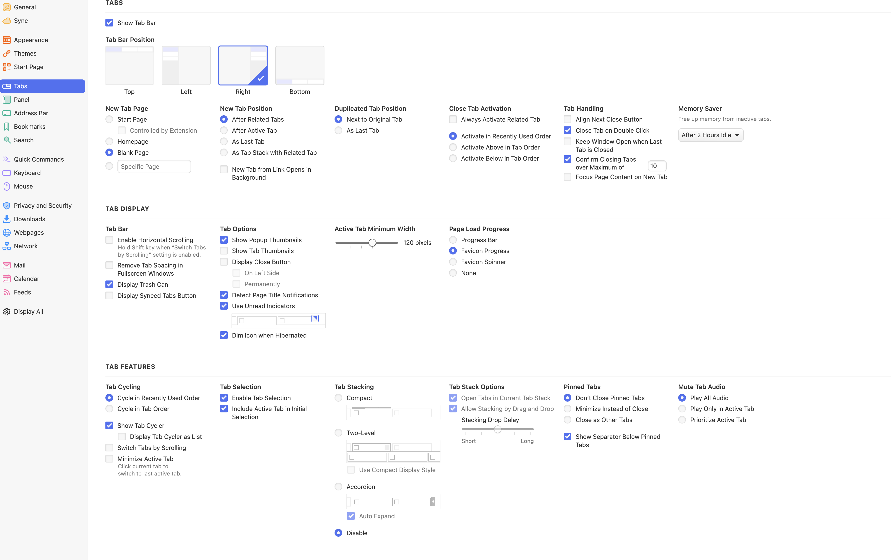

# Vivaldi Custom CSS Mod

This is my Vivaldi CSS mod inspired by Arc Browser. It creates a minimal, focused browsing experience with auto-hiding tabs and toolbar. Perfect for a clean, distraction-free interface.

## Installation

1. Open Vivaldi browser and go to `vivaldi://experiments/`
2. Enable "Allow for using CSS modifications"
3. Go to `vivaldi://settings/appearance/`
4. Under "Custom UI Modifications," click on "Select Folder" and choose the folder containing the `custom.css` file from this repository
5. Set the preferences as shown in the following screenshots
6. Restart Vivaldi browser

## Vivaldi Settings Screenshots

Here are the screenshots of the Vivaldi settings you need to modify:

1. Experiments page (`vivaldi://experiments/`):
   

1. Appearance settings page (`vivaldi://settings/appearance/`):
   

1. Tabs settings page (`vivaldi://settings/tabs/`):
   

## Customisation

Modify the `custom.css` file to add your desired CSS rules. Restart Vivaldi or reload the browser interface to see the changes.

## Contributing

Contributions are welcome! Please feel free to submit a Pull Request.

## License

This project is licensed under the MIT License - see the [LICENSE](LICENSE) file for details.
